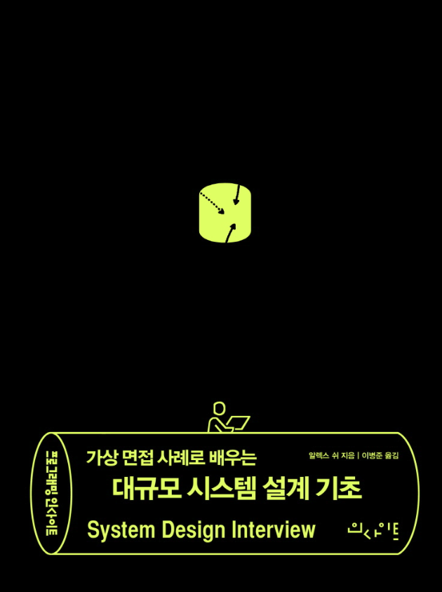

# Notification System
<p align="center">
  
</p>

이 프로젝트는 **"대규모 시스템 설계 기초"** 책을 읽고 학습한 내용을 바탕으로 설계되었습니다.  
실제 서비스에서 요구되는 알림 시스템의 요구사항과 아키텍처를 이해하고, 이를 실습 형태로 구현해본 것입니다.  

---

## 📦 시스템 주요 구성 요소

- **알림 제공자(Provider)**  
  알림 요청을 만들어 APNS, FCM, SMS 등 제3자 서비스로 보내는 주체입니다.
    - **단말 토큰(Device Token):** 알림 요청에 필요한 고유 식별자
    - **페이로드(Payload):** 알림 내용을 담은 JSON 딕셔너리
- **수신 채널 정보**  
  모바일 단말 토큰, 전화번호, 이메일 주소 등 알림을 보내기 위한 기본 정보가 필요합니다.

---

## ⚙️ 시스템 구조 및 이슈

### 설계 초기 문제점

- **SPOF (Single Point of Failure)**  
  알림 서비스에 장애가 발생하면 전체 서비스 장애로 이어질 수 있음.

- **규모 확장성 문제**  
  단일 서버에서 모든 기능을 처리하면, DB나 캐시 등의 중요 컴포넌트를 독립적으로 확장할 수 없음.

- **성능 병목**  
  알림 처리 과정(HTML 페이지 생성, 제3자 서비스 응답 대기 등)에서 많은 자원이 소모될 수 있음.

---

## 📬 메시지 큐 사용 이유

- 알림 서버와 시스템 컴포넌트 간 강한 결합을 끊기 위해
- 대량 알림 전송 시 서버 부하를 버퍼링하기 위해

---

## 📚 Redis 사용 이유

- 빠른 응답 속도 (메모리 기반 조회)
- 데이터베이스 부하 감소
- 대량 트래픽 대응 시 시스템 안정성 향상

특히 이메일 알림을 위해 HTML 포맷의 템플릿을 Redis에 저장하고, 빠르게 로딩하여 사용합니다.
1. H2 DB에 미리 여러 이메일 템플릿 (welcome, default 등) 등록. 
2. 이메일 보낼 때마다 템플릿 키와 변수 맵을 받아서 Redis에 템플릿을 캐싱해서 빠르게 조회.
3. 실제 이메일 본문은 템플릿에 변수를 치환해서 만들어서 발송하도록 변경.


## 🔥 시스템 컴포넌트 역할

| 컴포넌트 | 역할 |
|:---|:---|
| 알림 전송 API | 사내 서비스 또는 인증된 클라이언트만 사용 가능, 스팸 방지 |
| 알림 검증 | 이메일 주소, 전화번호 등 기본 검증 수행 |
| 데이터베이스 또는 캐시 질의 | 알림에 포함할 데이터 조회 |
| 알림 전송 | 알림 데이터를 메시지 큐에 넣음 |
| 캐시 | 사용자 정보, 단말 정보, 알림 템플릿 캐시 |
| 데이터베이스 | 사용자, 알림, 설정 데이터 저장 |
| 메시지 큐 | 시스템 간 의존성 제거 및 버퍼링 |
| 작업 서버(Worker) | 큐에서 알림 이벤트를 꺼내 제3자 서비스로 전송 |
| 제3자 서비스 | APNS, FCM, SMS 연동 |
| 단말 | Android, iOS 사용자 기기 |

---

## 🛠️ 알림 처리 흐름

1. 클라이언트가 API를 호출하여 알림 서버에 요청
2. 알림 서버는 사용자 정보, 단말 토큰, 알림 설정 정보를 캐시 또는 DB에서 조회
3. 알림 서버는 전송할 알림 이벤트를 생성하고, 해당 채널별 큐에 넣음
4. 작업 서버가 메시지 큐에서 알림 이벤트를 꺼냄
5. 작업 서버가 제3자 서비스(APNS, FCM 등)로 알림 전송
6. 제3자 서비스가 사용자 단말에 최종 알림 전송

---

## 🏗️ 프로젝트 구조

### 모듈 구성

- **api** : 알림 요청을 수신하고, 알림 이벤트를 큐로 발행하는 API 서버
- **core** : 공통 도메인(Entity, Repository, DTO, Kafka 메시지 등)
- **consumer** : 큐를 구독하고 제3자 서비스로 알림을 전송하는 작업 서버

---

## 🚀 기술 스택

- Spring Boot 3.4.5
- Spring Data JPA
- Spring Data Redis
- Spring for Apache Kafka
- H2 Database
- Docker Compose
---

## 🐳 Docker를 활용한 실행 환경

### 사용한 Docker 이미지

- **Kafka**: confluentinc/cp-kafka
- **Zookeeper**: confluentinc/cp-zookeeper
- **Redis**: redis:7.4.0

### 주요 Docker 명령어

#### 도커 컴포우즈로 카프카 및 레디스 컨테이너 실행
```
docker compose -f up -d         
```

#### 실행 중인 카프카
```
docker compose -f stop  
```

#### 카프카 컨테이너 내부 접속
```
docker exec -it <kafka-container-id> /bin/bash
```

#### 카프카 토픽 리스트 조회
```
kafka-topics --list --bootstrap-server localhost:9092
```
